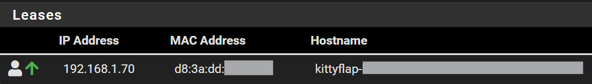

# Kittyhack

**English** | [Deutsch](#deutsch)

Kittyhack is an open-source replacement for the Kittyflap cloud/app. It lets you keep using your Kittyflap **fully offline** (local network only).

If you find bugs or have ideas, please use the GitHub issue tracker.

---

## What you can do with Kittyhack

- **Control who may enter/exit** (global rules or **individual rules per cat**)
- **Prey detection** (on/off) + **per-cat settings** (when enabled)
- **See events and pictures** (filter by date, cat/prey detection)
- **Live camera view** + detection overlay
- **Manage cats** (RFID, name, per-cat settings)
- **Use external IP cameras** (better angle / night vision compared to the internal camera)
- **Home Assistant integration** via MQTT
- **Train your own AI model** (optional) for better detection in your environment

### Remote mode (optional)

Run the Web UI + AI inference on a separate (more powerful) Linux PC/VM to get **higher inference FPS** and use bigger models.

See: [doc/remote-mode.md](doc/remote-mode.md)

---

## Installation (simple)

### What you need

- SSH access to your Kittyflap (user: `pi`, password: `kittyflap`)
- A stable WiFi connection during installation (downloads can be a few hundred MB)
- About **1 GB free space** on the Kittyflap
- **Python 3.11** is required (the setup script will try to provision it automatically on newer systems)

You can usually find the Kittyflap IP address in your router:

- Hostname starts with `kittyflap-`
- MAC address often starts with `d8:3a:dd`



### 1) Connect via SSH

```bash
ssh pi@<IP-address-of-Kittyflap>
```

### 2) Run the setup script

```bash
sudo curl -sSL https://raw.githubusercontent.com/floppyFK/kittyhack/main/setup/kittyhack-setup.sh -o /tmp/kittyhack-setup.sh \
  && sudo chmod +x /tmp/kittyhack-setup.sh \
  && sudo /tmp/kittyhack-setup.sh \
  && sudo rm /tmp/kittyhack-setup.sh
```

### 3) Open the Web UI

In your browser open:

`http://<IP-address-of-Kittyflap>`

Updates are available in the Web UI (Info section) or by re-running the setup script.

---

<details>
<summary><strong>Troubleshooting / Advanced (click to expand)</strong></summary>

### If your Kittyflap was never set up with the official app

If Kittyhack has never been installed and the cat flap has never been connected to your own Wi-Fi network, the Kittyflap usually already contains preconfigured Wi-Fi connections. Temporarily change your router WiFi to one of these:

- SSID: `Graewer factory`, Password: `Graewer2023`
- SSID: `Graewer Factory`, Password: `Graewer2023`
- SSID: `GEG-Gast`, Password: `GEG-1234`

Then:

1. Restart the Kittyflap
2. Wait until it shows up in your router
3. Connect via SSH and run the setup

### If you are low on disk space

Check free space:

```bash
df -h
```

If `/dev/mmcblk0p2` has less than ~1 GB free, free some space first.

Stop old Kittyflap services:

```bash
sudo systemctl stop kwork
sudo systemctl stop manager
```

If the flap is currently unlocked: disable the magnets (important to avoid overheating):

```bash
echo 525 > /sys/class/gpio/export 2>/dev/null
echo 524 > /sys/class/gpio/export 2>/dev/null

echo out > /sys/devices/platform/soc/fe200000.gpio/gpiochip0/gpio/gpio525/direction
echo out > /sys/devices/platform/soc/fe200000.gpio/gpiochip0/gpio/gpio524/direction

echo 0 > /sys/devices/platform/soc/fe200000.gpio/gpiochip0/gpio/gpio525/value
sleep 1
echo 0 > /sys/devices/platform/soc/fe200000.gpio/gpiochip0/gpio/gpio524/value
```

Reduce swap size (frees space on the root filesystem):

```bash
sudo swapoff /swapfile
sudo rm /swapfile

sudo fallocate -l 2G /swapfile
sudo chmod 600 /swapfile
sudo mkswap /swapfile
sudo swapon /swapfile
```

### Network / security note

The Web UI uses plain HTTP. This is generally fine in a **trusted LAN**.
Do not expose Kittyhack to the public internet. If you need remote access, use a VPN or a reverse proxy.

</details>

<details>
<summary><strong>FAQ (click to expand)</strong></summary>

### My Kittyflap disappears from WiFi after a few hours

This is usually weak WiFi signal (antenna is mounted on the outside of the flap). Move the router closer or improve coverage.

### Background turns gray / content disappears on my phone

Some phones/tablets suspend network connections in power-save mode. Since v1.5 the page should auto-reload after a disconnect.
If not, reload the page manually.

### Night mode / IR filter does not switch

The IR filter is controlled by the camera module itself. If it never clicks when you cover it in daylight, the module may be defective.
See: https://github.com/floppyFK/kittyhack/issues/81

### Too many false prey detections / boxes in wrong places

If you still use an original Kittyflap model, results may be poor. Training your own model is recommended.

EN wiki: https://github.com/floppyFK/kittyhack/wiki/%5BEN%5D-Kittyhack-v2.0-%E2%80%90-Train-own-AI%E2%80%90Models

### Constant motion detected outside

You can use the camera image for motion detection instead of the external PIR sensor (requires a good custom model).
Option: Configuration → Use camera for motion detection.

</details>

---

# Deutsch

Kittyhack ist ein Open-Source-Ersatz für die Kittyflap-Cloud/App. Damit kannst du deine Kittyflap **komplett offline** (nur im lokalen Netzwerk) weiter nutzen.

Wenn du Bugs findest oder Ideen hast, nutze bitte den GitHub Issue Tracker.

---

## Was Kittyhack kann

- **Steuern, wer rein/raus darf** (globale Regeln oder **individuell pro Katze**)
- **Beuteerkennung** (an/aus) + **pro Katze konfigurierbar** (wenn aktiviert)
- **Events & Bilder ansehen** (Filter nach Datum, Katze/Beute-Erkennung)
- **Live-Kamerabild** + Overlay mit erkannten Objekten
- **Katzen verwalten** (RFID, Name, Einstellungen pro Katze)
- **Externe IP-Kameras** (besserer Blickwinkel / bessere Nachtsicht als die interne Kamera)
- **Home Assistant** via MQTT
- **Eigenes KI-Modell trainieren** (optional) für bessere Ergebnisse in deiner Umgebung

### Remote-Mode (optional)

Weboberfläche + KI-Auswertung auf einem separaten (leistungsfähigeren) Linux-PC/VM ausführen, um **höhere FPS** zu erreichen und größere Modelle zu nutzen.

Siehe: [doc/remote-mode_de.md](doc/remote-mode_de.md)

---

## Installation (einfach)

### Voraussetzungen

- SSH-Zugriff auf die Kittyflap (User: `pi`, Passwort: `kittyflap`)
- Stabile WLAN-Verbindung während der Installation (Downloads können mehrere hundert MB sein)
- Ca. **1 GB freier Speicher** auf der Kittyflap
- **Python 3.11** wird benötigt (das Setup versucht es auf neueren Systemen automatisch bereitzustellen)

Die IP-Adresse findest du meist im Router:

- Hostname beginnt mit `kittyflap-`
- MAC-Adresse beginnt häufig mit `d8:3a:dd`


### 1) Per SSH verbinden

```bash
ssh pi@<IP-Adresse-der-Kittyflap>
```

### 2) Setup-Script ausführen

```bash
sudo curl -sSL https://raw.githubusercontent.com/floppyFK/kittyhack/main/setup/kittyhack-setup.sh -o /tmp/kittyhack-setup.sh \
  && sudo chmod +x /tmp/kittyhack-setup.sh \
  && sudo /tmp/kittyhack-setup.sh de \
  && sudo rm /tmp/kittyhack-setup.sh
```

### 3) Weboberfläche öffnen

Im Browser öffnen:

`http://<IP-Adresse-der-Kittyflap>`

Updates sind in der Weboberfläche (Info-Sektion) möglich oder durch erneutes Ausführen des Setup-Scripts.

---

<details>
<summary><strong>Probleme / Erweitert (klicken zum Aufklappen)</strong></summary>

### Falls deine Kittyflap nie mit der offiziellen App eingerichtet wurde

Wenn Kittyhack noch nie installiert wurde und die Katzenklappe noch nie mit deinem eigenen WLAN verbunden war, sind auf der Kittyflap in der Regel bereits vorab eingerichtete WLAN-Zugänge vorhanden. Stelle dein Router-WLAN vorübergehend auf eine dieser Kombinationen:

- SSID: `Graewer factory`, Passwort: `Graewer2023`
- SSID: `Graewer Factory`, Passwort: `Graewer2023`
- SSID: `GEG-Gast`, Passwort: `GEG-1234`

Dann:

1. Kittyflap neu starten
2. Warten, bis sie im Router sichtbar ist
3. Per SSH verbinden und Setup ausführen

### Falls der Speicherplatz knapp ist

Freien Speicher prüfen:

```bash
df -h
```

Wenn `/dev/mmcblk0p2` weniger als ~1 GB frei hat, zuerst Platz schaffen.

Alte Kittyflap-Services stoppen:

```bash
sudo systemctl stop kwork
sudo systemctl stop manager
```

Falls die Klappe gerade entriegelt ist: Magnete deaktivieren (wichtig, um Überlastung zu vermeiden):

```bash
echo 525 > /sys/class/gpio/export 2>/dev/null
echo 524 > /sys/class/gpio/export 2>/dev/null

echo out > /sys/devices/platform/soc/fe200000.gpio/gpiochip0/gpio/gpio525/direction
echo out > /sys/devices/platform/soc/fe200000.gpio/gpiochip0/gpio/gpio524/direction

echo 0 > /sys/devices/platform/soc/fe200000.gpio/gpiochip0/gpio/gpio525/value
sleep 1
echo 0 > /sys/devices/platform/soc/fe200000.gpio/gpiochip0/gpio/gpio524/value
```

Swap-Datei verkleinern (schafft Platz auf dem Root-Filesystem):

```bash
sudo swapoff /swapfile
sudo rm /swapfile

sudo fallocate -l 2G /swapfile
sudo chmod 600 /swapfile
sudo mkswap /swapfile
sudo swapon /swapfile
```

### Netzwerk / Sicherheit

Die Weboberfläche nutzt HTTP ohne Verschlüsselung. Das ist im **vertrauenswürdigen LAN** in der Regel ok.
Bitte nicht ins öffentliche Internet freigeben. Für Fernzugriff besser VPN oder Reverse Proxy nutzen.

</details>

<details>
<summary><strong>FAQ (klicken zum Aufklappen)</strong></summary>

### Meine Kittyflap verschwindet nach einigen Stunden aus dem WLAN

Meist ist das WLAN-Signal zu schwach (Antenne sitzt außen an der Klappe). Router näher platzieren oder WLAN-Abdeckung verbessern.

### Hintergrund wird grau / Inhalte verschwinden am Smartphone

Energiesparfunktionen können Verbindungen trennen. Seit v1.5 sollte die Seite nach einer Unterbrechung automatisch neu laden.
Falls nicht, Seite manuell neu laden.

### Nachtmodus / IR-Filter schaltet nicht

Der IR-Filter wird vom Kameramodul selbst gesteuert. Wenn bei Tageslicht beim Abdecken kein „Klick“ zu hören ist, ist das Modul evtl. defekt.
Siehe: https://github.com/floppyFK/kittyhack/issues/81

### Zu viele Fehl-Erkennungen / Boxen an falschen Stellen

Falls noch ein originales Kittyflap-Modell genutzt wird: Ergebnisse können schlecht sein. Ein eigenes Modell zu trainieren ist sehr empfehlenswert.

DE wiki: https://github.com/floppyFK/kittyhack/wiki/%5BDE%5D-Kittyhack-v2.0-%E2%80%90-Eigene-KI%E2%80%90Modelle-trainieren

### Ständig Bewegung außen erkannt

Du kannst statt des externen PIR-Sensors auch das Kamerabild zur Bewegungserkennung nutzen (setzt ein gutes eigenes Modell voraus).
Option: Konfiguration → Kamera für die Bewegungserkennung verwenden.

</details>