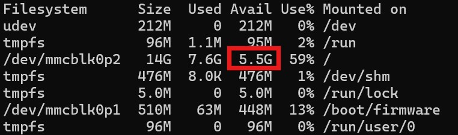
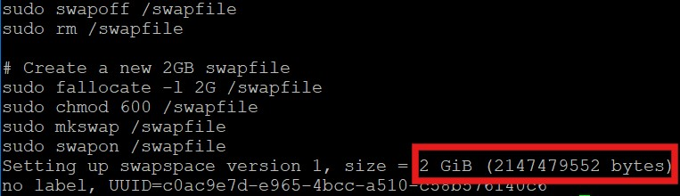

# Kittyhack

### [German version below / Deutsche Version weiter unten!](#deutsch)

---

Kittyhack is an open-source project that enables offline use of the Kittyflap cat door—completely without internet access. It was created after the manufacturer of Kittyflap filed for bankruptcy, rendering the associated app non-functional.

⚠️ **Important Notes**  
I have no connection to the manufacturer of Kittyflap. This project was developed on my own initiative to continue using my Kittyflap.

If you find any bugs or have suggestions for improvement, please report them on the GitHub issue tracker.

---

## Features

Current features:
- **Toggle prey detection**
- **Configure thresholds for mouse detection**
- **Switch entry direction** between "All cats", "All chipped cats", "my cats only" or "no cats"
- **Block exit direction**
- **Display captured images** (filterable by date, prey, and cat detection)
- **Show overlay with detected objects**
- **Live camera feed**
- **Manage cats and add new cats**
- **Show incoming/outgoing Events**
- **AI Training** Create a custom object detection model for your cat and your environment by using your own images
- **Support of external IP cameras** for enhanced viewing angles and improved night vision comapred to the internal Kittyflap camera
- **Home Assistant integration via MQTT**

---

## Installation

### Prerequisites
- Access to the Kittyflap via SSH  
  You can usually find the Kittyflap's IP address in your router.  
  - The hostname begins with `kittyflap-`
  - The MAC address should start with `d8:3a:dd`.
  

- **Python 3.11** is currently required. On newer systems (e.g. Debian 13 / Python 3.13 by default) the setup script will try to install/provision Python 3.11 automatically (via apt, or `uv` as fallback).

- Headless/container installs may need OpenCV runtime libraries (`libgl1`, `libglib2.0-0`). The setup script installs them automatically.

### If your Kittyflap hasn't been set up yet
If you never configured your Kittyflap with the official app, it is preset to a default WiFi network.
To establish a connection, you need to temporarily adjust your router's WiFi settings.

Use one of these combinations:
- SSID: `Graewer factory`, Password: `Graewer2023`
- SSID: `Graewer Factory`, Password: `Graewer2023`
- SSID: `GEG-Gast`, Password: `GEG-1234`

After changing the router SSID:
1. Restart the Kittyflap
2. Wait until it appears as a client in your router
3. Connect [via SSH](#ssh_access_en) (User: `pi`, Password: `kittyflap`)

Now proceed with the installation. You can add your own WLAN configuration later on in the Kittyhack Web interface.

### Instructions
The setup is quite simple:
<a id="ssh_access_en"></a>

1. **Establish SSH Access**  
   Open a terminal (on Windows, for example, with the key combination `[WIN]`+`[R]`, then enter `cmd` and execute) and connect to your Kittyflap via SSH with the following command:
   ```bash
   ssh pi@<IP-address-of-Kittyflap>
   ```
   Username: `pi`
   Default password: `kittyflap`  
   > **NOTE:** You have to enter the password "blindly", as no characters will be displayed while typing.

2. **Check available disk space**
   If your cat flap was still active for an extended period after the Kittyflap servers were shut down, the file system might be full.
   In this case, you need to free up space before installing Kittyhack.

   Check available disk space:
   ```bash
   df -h
   ```
   For `/dev/mmcblk0p2`, there should be **at least** 1 GB of free space available:  
   
   
   #### If less storage space is available, follow these steps - otherwise, proceed with the [Setup Script](#setup_en):
   
      1. Stop Kittyflap processes:
         ```bash
         sudo systemctl stop kwork
         sudo systemctl stop manager
         ```

      2. Release magnetic switches:
         **ATTENTION:** If one of the magnetic switches is still active at this point (i.e., the flap is unlocked), they will not be automatically deactivated until the end of the installation.  
            Please make sure to deactivate them now with these commands to avoid overloading the electromagnets:
         ```bash
         # Export GPIOs
         echo 525 > /sys/class/gpio/export 2>/dev/null
         echo 524 > /sys/class/gpio/export 2>/dev/null
         
         # Configure GPIO directions
         echo out > /sys/devices/platform/soc/fe200000.gpio/gpiochip0/gpio/gpio525/direction
         echo out > /sys/devices/platform/soc/fe200000.gpio/gpiochip0/gpio/gpio524/direction
         
         # Set default output values for GPIOs
         echo 0 > /sys/devices/platform/soc/fe200000.gpio/gpiochip0/gpio/gpio525/value
         sleep 1
         echo 0 > /sys/devices/platform/soc/fe200000.gpio/gpiochip0/gpio/gpio524/value
         ```

      3. Reduce the size of the swap file (by default, 6GB are reserved for this):
         ```bash
         # Turn off and remove the current swapfile
         sudo swapoff /swapfile
         sudo rm /swapfile

         # Create a new 2GB swapfile
         sudo fallocate -l 2G /swapfile
         sudo chmod 600 /swapfile
         sudo mkswap /swapfile
         sudo swapon /swapfile
         ```

         As confirmation, you will receive the size of the new swap file. The result should look something like this:
         

      After this, `/dev/mmcblk0p2` should have significantly more free space available.

<a id="setup_en"></a>

3. **Run the setup script on the Kittyflap**
    > **IMPORTANT:** Before starting the installation, please ensure that the WiFi connection of the cat flap is stable. During installation, several hundred MB of data will be downloaded!  
    > Since the antenna is mounted on the outside of the flap, the signal strength can be significantly weakened by e.g. a metal door.  

    You can check the strength of the WiFi signal with this command:
    ```bash
    iwconfig wlan0
    ```
    Run the installation:
   ```bash
   sudo curl -sSL https://raw.githubusercontent.com/floppyFK/kittyhack/main/setup/kittyhack-setup.sh -o /tmp/kittyhack-setup.sh && sudo chmod +x /tmp/kittyhack-setup.sh && sudo /tmp/kittyhack-setup.sh && sudo rm /tmp/kittyhack-setup.sh
   ```
   You can choose between the following options:
   - **Initial installation**: Performs the complete setup, including stopping and removing unwanted services on the Kittyflap (only to be executed once)
   - **Reinstall camera drivers**: This will reinstall the necessary device drivers in the system. Only to be executed if there are problems with the camera image. This installation is also possible directly through the web interface.
   - **Update to the latest version**: If a first-time installation of Kittyhack has already been performed, this option is sufficient to update to the latest version. The existing system configuration will not be changed.

   That's it!

### Access the Kittyhack Web Interface
Open the Kittyflap's IP address in your browser:
`http://<IP-address-of-Kittyflap>`

>#### Note
>⚠️ Since the connection is unencrypted, the browser will display a warning. This connection is generally safe within the local network, as long as you don't enable remote access 
to the Kittyflap via your router. For a secure connection, additional measures like setting up a reverse proxy can be taken.

>⚠️ To ensure Kittyhack is always reachable at the same IP address, it is recommended to assign a static IP address in your router.

### Updates
Updates for Kittyhack are available directly in the WebGUI in the 'Info' section.  
Alternatively, you can also run the [setup script](#setup_en) again on the Kittyflap to perform an update.


## Remote control

For a more detailed overview (requirements, setup, failure behavior), see [remote-mode.md](doc/remote-mode.md)

Kittyhack can be split into two roles:

- **Kittyhack**: runs on the Kittyflap hardware and controls sensors/actors (PIR, magnets/locks, RFID).
- **Remote control**: runs on a more powerful remote system and performs inference + Web-UI, while the Kittyflap exposes sensors/actors.

How it works:

- The target device runs an always-on service **kittyhack_control** listening on port **8888**.
- When a remote-mode instance connects, the target stops **kittyhack.service**, waits ~1s, then accepts remote control.
- If the remote connection is lost (timeout), the target automatically starts **kittyhack.service** again.

## FAQ

### My Kittyflap disappears from my WLAN after a few hours
The WLAN signal is probably too weak because the WLAN antenna is mounted on the outside of the Kittyflap and has to pass therefore an additional wall or door to reach your router.  
Make sure the distance to the router is not too great. If the WLAN signal is too weak, the Kittyflap will eventually disconnect and will only reconnect after being restarted by 
unplugging and plugging it back in (I am still investigating why this happens - I am trying to find a solution!).  

### Why does the website background turn gray and the content disappear when I try to switch sections?
This issue is caused by the power-saving features of smartphones and tablets: When your browser on your smartphone loses focus (for example, when switching to the home screen), the connection to the Kittyhack page is interrupted after a few seconds.  
By now (since v1.5), the page should automatically reload itself after such a connection loss. If this does not happen, please reload the page manually (e.g., using the refresh gesture).

### I have successfully installed Kittyhack. Shouldn't the night light be activated when it gets too dark?
The switching to night mode (infrared filter) is handled automatically by the built-in camera module. If you cover the area of the camera module completely with your hand during sufficient daylight, you should hear a faint clicking sound. If you do not hear this click, the switching is probably defective.  
There have already been some cases where the switching was defective. In this case, the module (Akozon 5MP OV5647) unfortunately has to be replaced.  
You can find more details in this post: https://github.com/floppyFK/kittyhack/issues/81

### My cat flap recognizes everything as prey - except the actual prey. The detected zones are somewhere random in the image.
You are probably still using an original object detection model from Kittyflap. These original models are not reliable!  
It is highly recommended to train your own model. You can find instructions in the [Wiki](https://github.com/floppyFK/kittyhack/wiki/%5BEN%5D-Kittyhack-v2.0-%E2%80%90-Train-own-AI%E2%80%90Models).  
If you are already using your own model, continue to train and refine it. Also, make sure that only high-quality and meaningful images are included in your datasets.

### I constantly get motion detected outside - what can I do?
Starting with version 2.1.0, you can use the camera image for motion detection as an alternative to the external PIR sensor.  
This significantly reduces false triggers, for example by trees or people in the image. However, a well-trained, custom detection model is required for this feature.  
You can find the option under **Configuration** → **Use camera for motion detection**.


---


# DEUTSCH

Kittyhack ist ein Open-Source-Projekt, das die Offline-Nutzung der Kittyflap-Katzenklappe ermöglicht – ganz ohne Internetzugang. Es wurde ins Leben gerufen, nachdem der Anbieter der Kittyflap Insolvenz angemeldet hat und die zugehörige App nicht mehr funktionierte.

⚠️ **Wichtige Hinweise**
Ich stehe in keinerlei Verbindung mit dem Hersteller der Kittyflap. Dieses Projekt wurde aus eigenem Antrieb erstellt, um meine eigene Katzenklappe weiterhin nutzen zu können.

Wenn du Bugs findest oder Verbesserungsvorschläge hast, melde sie bitte im Issue Tracker dieses GitHub Projekts.

---

## Funktionsumfang

Aktuelle Features:
- **Beuteerkennung ein-/ausschalten**
- **Schwellwerte für Mauserkennung konfigurieren**
- **Eingangsrichtung umschalten** zwischen "Alle Katzen", "Alle gechippten Katzen", "nur meine Katzen" oder "keine Katzen"
- **Ausgangsrichtung blockieren**
- **Aufgenommene Bilder anzeigen** (filterbar nach Datum, Beute und Katzenerkennung)
- **Overlay mit erkannten Objekten anzeigen**
- **Live-Bild der Kamera**
- **Katzen verwalten und neue Katzen hinzufügen**
- **Ereignisse von ankommenden/rausgehenden Katzen anzeigen**
- **"KI" Modell Training** Erstelle ein individuelles Objekterkennungsmodell für deine Katze und deine Umgebung anhand der eigenen Bilder
- **Support externer IP-Kameras** für bessere Blickwinkel und verbesserte Nachtsicht gegenüber der internen Kittyflap Kamera
- **Home Assistant Unterstützung via MQTT**

---

## Installation

### Voraussetzungen
- Zugriff auf die Kittyflap per SSH  
  Die IP-Adresse der Kittyflap kann üblicherweise im Router ausgelesen werden.  
  - Der Hostname beginnt mit `kittyflap-`
  - Die MAC-Adresse sollte mit `d8:3a:dd` beginnen.
  

### Wenn deine Kittyflap noch nicht eingerichtet wurde
Falls du deine Kittyflap nie mit der offiziellen App konfiguriert hast, ist sie auf ein Standard-WLAN voreingestellt.
Um eine Verbindung herzustellen, musst du vorübergehend die WLAN-Einstellungen deines Routers anpassen.

Verwende eine dieser Kombinationen:
- SSID: `Graewer factory`, Passwort: `Graewer2023`
- SSID: `Graewer Factory`, Passwort: `Graewer2023`
- SSID: `GEG-Gast`, Passwort: `GEG-1234`

Nach Änderung der Router-SSID:
1. Starte die Kittyflap neu
2. Warte bis sie im Router als Client erscheint
3. Verbinde dich [per SSH](#ssh_access_de) (Benutzer: `pi`, Passwort: `kittyflap`)

Fahre jetzt mit der Installation fort. Du kannst dein eigenes WLAN später im Web Interface von Kittyhack konfigurieren.

### Anleitung
Die Installation ist kinderleicht:
<a id="ssh_access_de"></a>

1. **SSH-Zugriff herstellen**  
   Öffne ein Terminal (unter Windows z.B. mit der Tastenkombination `[WIN]`+`[R]`, dann `cmd` eingeben und ausführen) und verbinde dich mit dem folgenden Kommando per SSH zu deiner Kittyflap:
   ```bash
   ssh pi@<IP-Adresse-der-Kittyflap>
   ```
   Benutzername: `pi`
   Standardpasswort: `kittyflap`  
   > **HINWEIS:** Du musst das Passwort "blind" eingeben, da beim Tippen keine Zeichen angezeigt werden.

2. **Freien Speicherplatz überprüfen**
   Falls deine Katzenklappe nach der Abschaltung der Kittyflap-Server noch längere Zeit aktiv war, kann es sein, dass das Dateisystem vollgeschrieben ist.
   In diesem Fall musst du vor der Installation von Kittyhack erst Platz schaffen.

   Vorhandenen Speicherplatz überprüfen:
   ```bash
   df -h
   ```
   Für `/dev/mmcblk0p2` sollte **mindestens** 1 GB freier Speicherplatz zur Verfügung stehen:  
   
   
   #### Falls weniger Speicherplatz verfügbar ist, führe folgende Schritte aus - ansonsten fahre fort mit dem [Setup Script](#setup_de):
   
      1. Kittyflap-Prozesse stoppen:
         ```bash
         sudo systemctl stop kwork
         sudo systemctl stop manager
         ```

      2. Magnetschalter deaktivieren:
         **ACHTUNG:** Falls zu diesem Zeitpunkt noch einer der Magnetschalter aktiv ist (also die Klappe entriegelt ist), werden diese bis zum Ende der Installation nicht mehr automatisch deaktiviert.  
         Bitte deaktiviere sie unbedingt jetzt mit diesen Kommandos, um die Elektromagneten nicht zu überlasten:
         ```bash
         # Export GPIOs
         echo 525 > /sys/class/gpio/export 2>/dev/null
         echo 524 > /sys/class/gpio/export 2>/dev/null
         
         # Configure GPIO directions
         echo out > /sys/devices/platform/soc/fe200000.gpio/gpiochip0/gpio/gpio525/direction
         echo out > /sys/devices/platform/soc/fe200000.gpio/gpiochip0/gpio/gpio524/direction
         
         # Set default output values for GPIOs
         echo 0 > /sys/devices/platform/soc/fe200000.gpio/gpiochip0/gpio/gpio525/value
         sleep 1
         echo 0 > /sys/devices/platform/soc/fe200000.gpio/gpiochip0/gpio/gpio524/value
         ```


      3. Größe der Swap-Datei reduzieren (standardmäßig sind hierfür 6GB reserviert):
         ```bash
         # Turn off and remove the current swapfile
         sudo swapoff /swapfile
         sudo rm /swapfile

         # Create a new 2GB swapfile
         sudo fallocate -l 2G /swapfile
         sudo chmod 600 /swapfile
         sudo mkswap /swapfile
         sudo swapon /swapfile
         ```

         Als Bestätigung bekommst du die Größe des neuen Swap-Datei zurückgemeldet. Das Ergebnis sollte etwa so aussehen:
           

      Danach sollte für `/dev/mmcblk0p2` deutlich mehr freier Speicherplatz verfügbar sein.

<a id="setup_de"></a>

3. **Das Setup Script auf der Kittyflap ausführen**
   > **WICHTIG:** Bitte stelle vor dem Start der Installation sicher, dass die WLAN-Verbindung der Katzenklappe stabil ist. Während der Installation werden mehrere hundert MB an Daten heruntergeladen!  
   > Da die Antenne auf der Außenseite der Klappe angebracht ist, kann die Signalstärke durch z.B. eine Metalltür stark abgeschwächt werden.  
   
   Mit diesem Befehl kannst du die Stärke des WLAN-Signals überprüfen:
   ```bash
   iwconfig wlan0
   ```
   Installation ausführen:
   ```bash
   sudo curl -sSL https://raw.githubusercontent.com/floppyFK/kittyhack/main/setup/kittyhack-setup.sh -o /tmp/kittyhack-setup.sh && sudo chmod +x /tmp/kittyhack-setup.sh && sudo /tmp/kittyhack-setup.sh de && sudo rm /tmp/kittyhack-setup.sh
   ```
   Du hast die Auswahl zwischen folgenden Optionen:
   - **Erstmalige Installation**: Führt das komplette Setup aus, inklusive stoppen und entfernen von ungewollten Services auf der Kittyflap (nur erstmalig auszuführen)
   - **Kameratreiber erneut installieren**: Damit werden die erforderlichen Gerätetreiber im System erneut installiert. Nur auszuführen, wenn es Probleme mit dem Kamerabild geben sollte. Diese Installation ist auch direkt über das Web-Interface möglich.
   - **Update auf die neueste Version**: Wenn bereits eine erstmalige Installation von Kittyhack ausgeführt wurde, reicht diese Option, um auf den aktuellsten Stand zu aktualisieren. An der bestehenden Systemkonfiguration wird nichts geändert.

   Das war's!

### Zugriff auf das Kittyhack Webinterface
Rufe die IP-Adresse der Kittyflap in deinem Browser auf:
`http://<IP-Adresse-der-Kittyflap>`

>#### Hinweis
>⚠️ Da die Verbindung nicht verschlüsselt ist, wird der Browser eine Warnung anzeigen. Diese Verbindung ist innerhalb des lokalen Netzwerks in der Regel sicher, solange du keinen Fernzugriff 
auf die Kittyflap über deinen Router freigibst. Für eine sichere Verbindung können zusätzliche Maßnahmen wie ein Reverse-Proxy eingerichtet werden.

>⚠️ Damit Kittyhack immer unter der selben IP Adresse erreichbar ist, empfiehlt es sich, im Router eine statische IP Adresse zu vergeben.

### Updates
Updates von Kittyhack sind direkt in der WebGUI in der Sektion 'Info' möglich.  
Alternativ zu den Updates über die WebGUI kann auch das [Setup Script](#setup_de) erneut ausgeführt werden. Auch dort ist ein Update möglich.


## Fernsteuerung

Für einen detaillierteren Überblick (Anforderungen, Einrichtung, Verhalten bei Ausfällen), siehe [remote-mode_de.md](doc/remote-mode_de.md)

Kittyhack kann in zwei Rollen aufgeteilt werden:

- **Kittyhack**: läuft auf der Kittyflap-Hardware und steuert nur noch die Sensoren/Aktoren (PIR, Magnete/Verriegelungen, RFID).
- **Remote Control**: läuft auf einem leistungsfähigeren Remote-System und führt Inference + WebGUI aus, während die Kittyflap ihre Sensoren/Aktoren exponiert.

## FAQ

### Meine Kittyflap verschwindet nach einigen Stunden immer wieder aus meinem WLAN
Wahrscheinlich ist das WLAN Signal zu schwach, da die WLAN-Antenne auf der Außenseite der Kittyflap angebracht ist und bis zu deinem Router somit eine zusätzliche Wand bzw. Türe durchdringen muss.  
Achte darauf, dass die Entfernung zum Router nicht zu groß ist. Wenn das WLAN-Signal zu schwach ist, meldet sich die Kittyflap irgendwann ab und wählt sich erst wieder ein,
wenn sie durch Aus- und Wiedereinstecken neu gestartet wurde (warum das so ist untersuche ich noch - ich versuche, eine Lösung dafür zu finden!)   

### Warum ist der Hintergrund der Website ausgegraut und der Inhalt verschwindet, wenn ich versuche, die Sektion wechsle?
Dieses Problem hängt mit den Energiesparfunktionen von Smartphones und Tablets zusammen: Wenn dein Browser auf dem Smartphone den Fokus verliert (z. B. beim Wechsel auf den Homescreen), wird nach wenigen Sekunden die Verbindung zur Kittyhack-Seite getrennt.  
Inzwischen (seit v1.5) sollte die Seite sich bei einem solchen Verbindungsabbruch automatisch neu laden. Falls das nicht geschieht, lade die Seite bitte einmal manuell neu (z. B. mit der Aktualisieren-Geste).

### Ich habe Kittyhack erfolgreich installiert. Sollte nun nicht das Nachtlicht aktiviert werden, wenn es zu dunkel ist?
Die Umschaltung zum Nachtlicht (Infrarot-Filter) erfolgt autark über das verbaute Kameramodul. Wenn der Bereich des Kameramoduls – bei ausreichendem Tageslicht – vollflächig mit der Hand abgedeckt wird, sollte ein leises Klicken zu hören sein. Ist dieses Klicken nicht zu hören, ist die Umschaltung vermutlich defekt.  
Es gab bereits einige Fälle, bei denen die Umschaltung defekt war. In diesem Fall muss das Modul (Akozon 5MP OV5647) leider ausgetauscht werden.  
Weitere Details findest du in diesem Beitrag: https://github.com/floppyFK/kittyhack/issues/81

### Bei meiner Katzenklappe wird alles mögliche als Beute erkannt, nur nicht die Beute selbst. Die Zonen für die erkannten Bereiche liegen irgendwo im Bild.
Du verwendest vermutlich noch ein originales Modell der Kittyflap für die Objekterkennung. Diese Modelle sind nicht zuverlässig!  
Trainiere unbedingt ein eigenes Modell. Wie das funktioniert, kannst du im [Wiki](https://github.com/floppyFK/kittyhack/wiki/%5BDE%5D-Kittyhack-v2.0-%E2%80%90-Eigene-KI%E2%80%90Modelle-trainieren) nachlesen.  
Falls du bereits ein eigenes Modell verwendest, solltest du es weiter trainieren und verfeinern. Achte außerdem darauf, dass nur wirklich gute und aussagekräftige Bilder in deinen Datensätzen enthalten sind.

### Bei mir wird ständig Bewegung außen erkannt, was kann ich tun?
Ab Version 2.1.0 kannst du alternativ zum äußeren PIR-Sensor auch das Kamerabild zur Bewegungserkennung nutzen.  
Dies reduziert Fehlauslösungen, zum Beispiel durch Bäume oder Menschen im Bild, deutlich. Voraussetzung ist jedoch ein gut trainiertes, eigenes Erkennungsmodell.  
Die Option findest du unter **Konfiguration** → **Kamera für die Bewegungserkennung verwenden**.