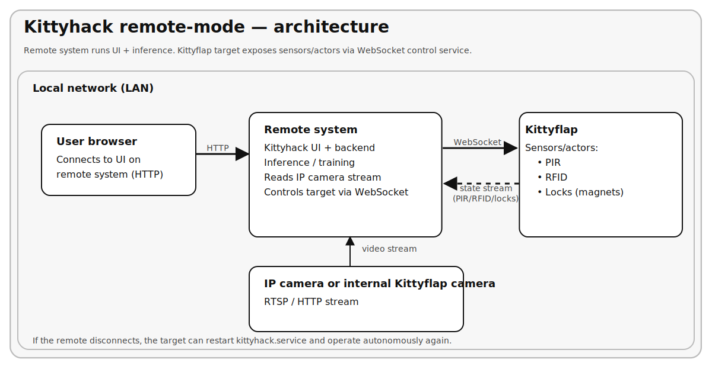
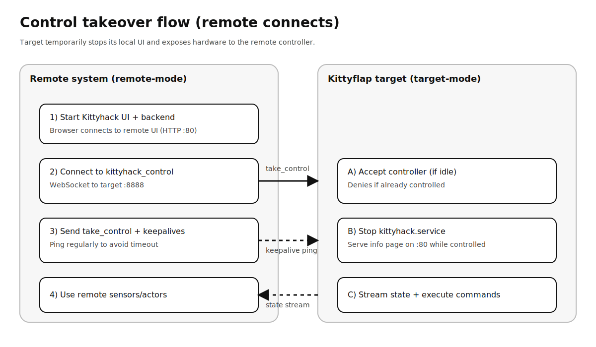
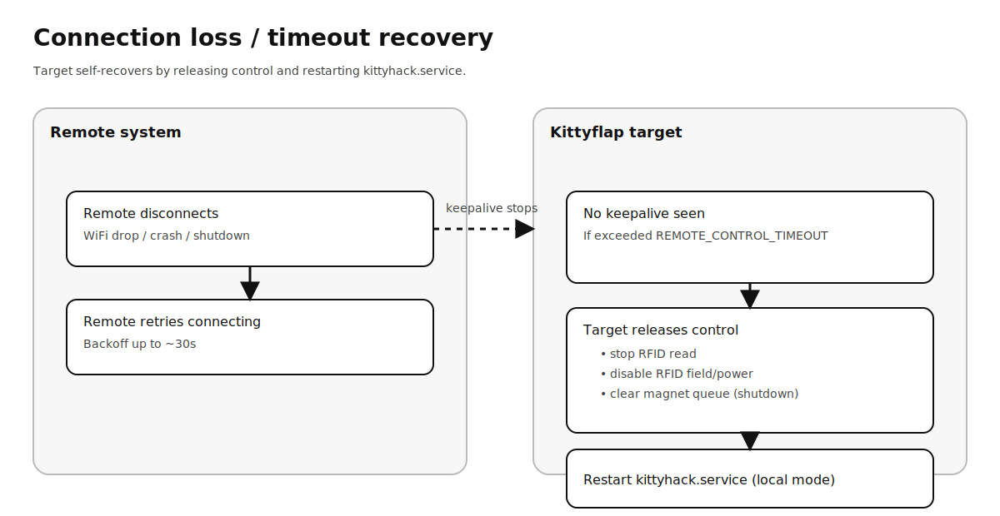

# Remote mode (remote-control) — Overview

**Language:** English | [Deutsch](remote-mode_de.md)

Remote mode is an **optional, experimental** way to split Kittyhack into two roles:

- **target-mode (Kittyflap hardware)**: controls sensors/actors (PIR, magnets/locks, RFID) and runs a small "remote-control" service.
- **remote-mode (separate Linux PC/VM)**: runs the **Web UI + inference** on faster hardware and controls the target over the network.

This is useful, since the Kittyflap hardware is very CPU-limited on inference and also not very robust against EMC (false alarms may be triggered on the PIR sensors on high CPU load and/or WiFi traffic).

---

## Schematics

### Architecture (who talks to whom)



## What runs where

### Target device (Kittyflap)
- Runs systemd service **`kittyhack_control.service`** (WebSocket server on port **8888**).
- Normally runs **`kittyhack.service`** (Kittyhack UI + backend on port **80**).
- When remote-mode connects and takes control:
  - the target **stops `kittyhack.service`** (so port 80 on the target is no longer the normal UI),
  - serves a small **info page on port 80** ("this device is controlled remotely"),
  - keeps hardware access local and streams state (PIR, locks, RFID) to the remote.

### Remote system (Linux PC/VM)
- Runs **`kittyhack.service`** (Web UI + backend/inference on port **80**).
- Connects to the target's `kittyhack_control` via WebSocket to:
  - read PIR + RFID state,
  - send magnet / RFID commands,
  - optionally request a one-time initial sync of database/config/pictures/models.

---

## Requirements

### Hardware / OS (remote system)
- **Debian or Ubuntu** (or similar derivative)
- **AMD64 (x86_64)** machine (regular Intel/AMD 64-bit PC)
- **≥ 2 GB RAM**

### Software (remote system)
The setup script installs these (remote-mode option):
- Python tooling (`python3`, `python3-venv`, `python3-pip`) and a **Python 3.11** virtualenv
- Utilities: `rsync`, `git`, `curl`, `ca-certificates`
- OpenCV runtime libs: `libgl1`, `libglib2.0-0`

### Target device
- Kittyhack installed normally on the Kittyflap.
- `kittyhack_control.service` must be running on the target.

### Network
- Remote system must reach the target on:
  - **TCP 8888** (WebSocket remote-control)
  - **TCP 80** (optional: target info page; not required for control)
- The remote system's UI runs on **TCP 80**.

**Security note:** the remote-control WebSocket is intended for a **trusted LAN**. Do not expose port 8888 to the public internet.

---

## Setup instructions

### Control takeover flow (what happens when the remote connects)



### 1) Install / verify target-mode on the Kittyflap
Install Kittyhack on the Kittyflap as usual (SW version 2.5.0 or higher).

Confirm services on the target:

```bash
sudo systemctl status kittyhack
sudo systemctl status kittyhack_control
```

### 2) Install remote-mode on the remote Linux PC/VM
Run the setup script on the remote system and choose the **remote-mode** option.

### 3) First start: remote-mode setup in the Web UI
When remote-mode starts the first time, you have to configure the remote (Kittyflap) IP address.

Open the remote UI in your browser:

- `http://<IP-of-remote-system>/`

### 4) Configure IP camera
Remote-mode currently requires an **IP camera** (the Kittyflap internal camera stream is not used in remote-mode).

Set your IP camera URL in the Kittyhack settings on the remote UI.

---

## Initial sync (first remote connect)

On first connect (optional), remote-mode can request a sync from the target.

What may be transferred from the target:
- `kittyhack.db`
- `config.ini`
- pictures directory (if enabled)
- YOLO model directory (if enabled)

Notes:
- This can be **large** if you include pictures.
- A local marker file (`<kittyhack.db>.remote_synced`) is created on the remote system to avoid repeated sync requests.
  - Delete that marker if you want to force another initial sync.

---

## What happens if the remote connection is lost?



### Kittyflap behavior (safety / fallback)
If the remote controller disconnects or stops sending keepalives for longer than the configured timeout:
- the Kittyflap **releases remote control**,
- safety actions are performed:
  - RFID read is stopped
  - RFID field/power is disabled
  - magnet queue is cleared (shutdown)
- the Kittyflap stops the temporary info page on port 80,
- the Kittyflap **restarts `kittyhack.service`** so it can operate on its own again.

In other words: remote-mode is designed so the Kittyflap can recover and continue running autonomously when the remote link is gone.

### Remote behavior
- The remote client logs the disconnect and **retries** with exponential backoff.
- Until it reconnects, "remote hardware" (PIR/RFID/locks) data may stop updating.

---

## Troubleshooting

- **Remote can't connect to Kittyflap**
  - Check Kittyflap is reachable: `ping <kittyflap-ip>`
  - Verify `kittyhack_control` is listening: `sudo ss -ltnp | grep 8888`
  - Check firewalls between remote and Kittyflap.

- **Kittyflap UI shows an info page instead of Kittyhack**
  - That means a remote controller currently holds control (or did not release cleanly yet).
  - Wait for the timeout or restart `kittyhack` on the Kittyflap:
    - `sudo systemctl restart kittyhack`

- **Force remote-mode off**
  - Remove the marker file `.remote-mode` from the Kittyhack folder and restart the service.

---

## Reference: config files

- `config.ini`: shared settings (may be synced from Kittyflap during initial sync)
- `config.remote.ini`: **remote-only overlay** for remote-mode parameters (host/port/timeout/sync options)
